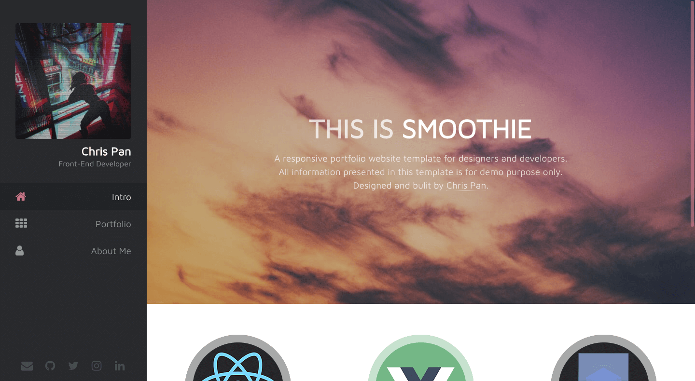

# Smoothie
A responsive portfolio website template for designers and developers.

## Preview
[Click here](http://panteng.github.io/Smoothie/)

## Why This Project
This Smoothie template is one of my old projects in my early years as a FE developer. I once used it as my own personal website. Now I want to share it and hopefully it can help someone who needs to build a portfolio website.

## How to Customize
1. Run `npm install` to start installing all dependencies.
2. Run `gulp dev` to start development process. Now every file change you make under app/src folder will be immediately reflected in your browser at `http://localhost:3000`.

## How to Use in Production
1. Run `gulp prod` command to start file concatenating & compressing process.
2. Upload all files under app/dist to your server.

## Credits
Inspired by Prologue(https://html5up.net/prologue).

## License
Creative Commons (CC) license
